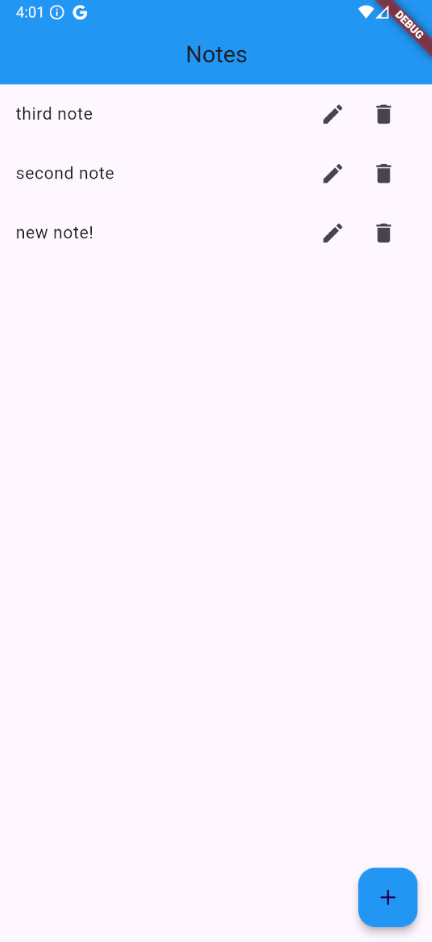

# 📃 Notes App Firebase

Bienvenue dans **Notes App Firebase** — une application Flutter permettant de gérer des notes avec des opérations **CRUD** ( Create, Read, Update, Delete ) 📝. Ce projet utilise **Firebase** comme backend pour stocker et synchroniser les données.

## 🌐 Technologies Utilisées
- **Flutter** 🎨 : Framework pour construire des applications multiplateformes.
- **Firebase Firestore** 🔖 : Base de données cloud NoSQL.

## 🔧 Fonctionnalités
- ➕ Ajouter des notes.
- ✏️ Mettre à jour des notes.
- ❌ Supprimer des notes.
- 🔄 Synchronisation en temps réel avec Firebase Firestore.

## 🕵️‍♂️ Aperçu du Code
### Home Page 🏠
Le fichier principal pour la logique de l'application est **home_page.dart** :
- Gestion des notes via Firestore.
- Interface utilisateur (UI) simple avec une liste des notes.
- Dialogues pour créer et modifier les notes.

### Services Firestore ⚡
Le fichier **firestore.dart** contient les opérations CRUD :
- `createNote` : Ajoute une nouvelle note dans Firestore.
- `updateNote` : Modifie une note existante.
- `deleteNote` : Supprime une note.
- `getNotesStream` : Fournit un flux en temps réel des notes.

## ✨ Capture d'écran


## 🚀 Lancer le Projet
1. **Cloner le dépôt** :
   ```bash
   git clone https://github.com/julienBelinga/noteAppFirebase.git
   ```
2. **Installer les dépendances** :
   ```bash
   flutter pub get
   ```
3. **Configurer Firebase** :
   - Créez un projet Firebase et ajoutez les configurations (GoogleService-Info.plist et google-services.json).
   - Mettez à jour votre fichier `firebase_options.dart`.
4. **Exécuter l'application** :
   ```bash
   flutter run
   ```

## 📊 Aperçu de Firebase Firestore
Les notes sont stockées dans la collection **notes** sous forme de documents avec les champs suivants :
- **id** : Identifiant unique.
- **note** : Contenu de la note.

Lien Firebase : [Console Firestore](https://console.firebase.google.com/project/tutofirebase-2c533/firestore/databases/-default-/data/~2Fnotes~2FVzgEBliuKmBtljB00X4p)

## 🔧 Améliorations Futures
- 🌐 Ajouter la prise en charge multiplateforme (web, desktop).
- 🔒 Implémenter une authentification utilisateur Firebase.
- 🎨 Améliorer l'interface utilisateur avec des animations.

## 💎 Auteur
Ce projet a été réalisé afin de  moter en compétence et découvrir flutter ainsi que Firebase.